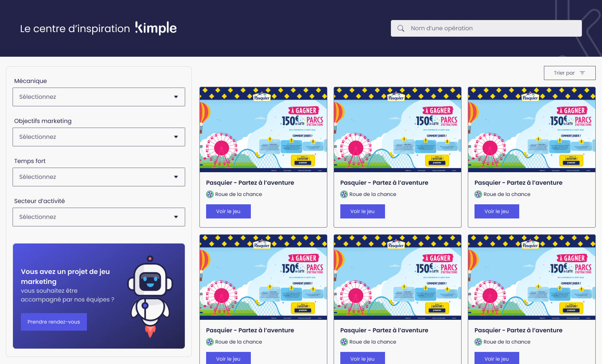

# Centre d'inspiration Kimple

Ce projet est un site web utilisé par les équipes commerciales et marketing de Kimple pour montrer aux clients et potentiels clients des jeux concours qui ont été réalisés pour d'autres clients. Il prend la forme d'un catalogue de jeux concours avec filtres, chaque jeu pouvant être essayé en cliquant dessus.

Des variables d'environnement (`.env`) sont nécessaires pour faire fonctionner le projet. Il est évident que je ne peux pas les publier publiquement sur GitHub.

## Spécifications fonctionnelles

Le projet est une refonte moderne du vieux projet disponible sur [inspiration.kimpleapp.com](https://inspiration.kimpleapp.com/).

Cependant, ne pouvant réellement lier le projet à l'écosystème de Kimple, il m'a été demandé de faire une version MVP dont le code peut être publiquement disponible sur GitHub pour les besoins d'Openclassrooms. Une fois le projet terminé, il sera déplacé sur un dépôt privé de Kimple et amélioré pour intégrer la librairie de composants de Kimple.

## Définition des interfaces

Le designer UX/UI a eu pour tâche de mettre à jour le centre d'inspiration avec la charte graphique actuelle de Kimple pour l'occasion. Il m'a donc fourni une [maquette Figma](https://www.figma.com/design/fqMv3L1X3mAD0IgItk3ss1/Centre-d-inspiration?node-id=4131-3313&t=G1Lxp8RGotBvKGF3-1) à suivre.

Le figma étant privé, voici l'export de la version desktop de la maquette :

## L'API

Je travaille tous les jours avec la [documentation Swagger](https://api-dev.kimpleapp.com/api/doc) de l'API de Kimple qui contient de nombreuses routes. Celles qui m'intéressent pour ce projet sont :

- GET `/frontend/inspiration_center/list` : pour récupérer la liste des jeux concours à afficher dans le catalogue
- GET `/frontend/inspiration_center/option` : pour récupérer les options de filtres ainsi que les noms des mécaniques de jeu
